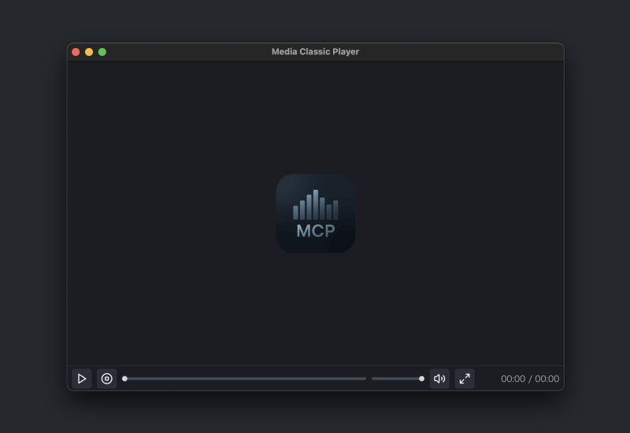

# 🎬 Mac Classic Player

> A lightweight, keyboard-friendly media player for macOS — inspired by Media Player Classic.

---

**Mac Classic Player** (a.k.a **MCP**) is a minimalist and responsive video and audio player built for macOS, featuring:

- 🎥 MPC-inspired UI
- ⌨️ Keyboard-first control (seek, mute, fullscreen, and more)
- 🧭 Drag & drop or one-click file loading
- 💾 Auto-save volume and window size
- 🖥 Native `.mov`, `.mp4`, `.webm`, and audio formats like `.mp3`, `.m4a`, `.wav` support (with `.hevc` planned)

---

## 🚀 Features

| Feature               | Description                           |
| --------------------- | ------------------------------------- |
| 🔄 Play / Pause       | Spacebar or click anywhere            |
| ⏹ Stop               | Resets to beginning                   |
| ↔ Seek               | Arrow keys, or click-and-drag slider  |
| 🔊 Volume control     | Mouse or keyboard ↑↓ keys             |
| 🔁 Playlist support   | Multiple file queue with looping      |
| 🖱 Drag & Drop        | or click to open local files          |
| ⌨️ File Open Shortcut | `O` via menu or hotkey                |
| 🖥 Fullscreen toggle  | `F` key or button (with icon change)  |
| 💾 Persistent state   | Volume & window size remembered       |
| 🎵 Audio support      | Supports `.mp3`, `.m4a`, `.wav`, etc. |

---

## 🛠 Installation

[⬇ Download the latest version](https://github.com/piro0919/mac-classic-player/releases/latest)

Or build it locally:

```bash
git clone https://github.com/piro0919/mac-classic-player
cd mac-classic-player
npm install
npm run start
```

---

## 📸 Preview



---

## 📝 License

MIT — Feel free to fork and extend!

---

## 🙌 Credits

Built with ❤️ using [Electron](https://www.electronjs.org/) + [React](https://react.dev) + [lucide-react](https://lucide.dev)

Inspired by [Media Player Classic](https://mpc-hc.org/)
